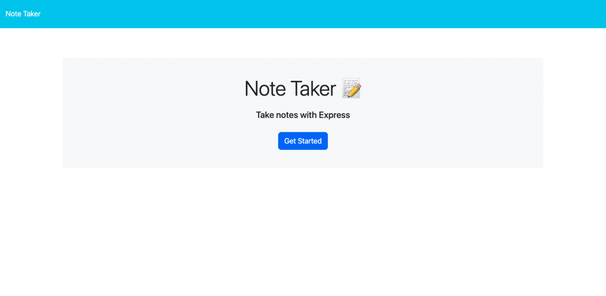

# NoteTaker_expressJS
[](https://opensource.org/licenses/MIT)
Notetaker web application built with Express JS
  
## Description

This is a simple note-taking application created with Express and NodeJS that allows users to create, save and delete their notes.


## Usage Instructions
1. Click here to open the [Deployed Application](https://notetaker1stbuild.herokuapp.com/)
2. Click the "Get Started" button to open the note taker application.
3. Enter text into the 'title' and 'text' fields 
4. Click the save icon (upper right corner) to save the note.
5. Click the "+" icon (upper right corner) to add another note.
6. Click the trash icon to delete saved notes.

## Deployed Application Link:
* Deployed Application Link: (https://notetaker1stbuild.herokuapp.com/)
* Github repository: (https://github.com/lingeorge88/NoteTaker_expressJS)

## Screenshots:
### Application demo 


## Installation Process
1. Clone the Repository from GitHub (or) Download Zip Folder from Repository from GitHub
2. Open the cloned (or downloaded) repository in any source code editor (VScode was used during build and testing).
3. Open the CLI terminal in the project's root directory, install the required packages with the following command: 
```bash
npm install
```
and run the program using the following command:
```bash
node server.js
```
Open the application in the browser: http://localhost:3001/

OR 
View the deployed application at the Heroku link: (https://notetaker1stbuild.herokuapp.com/)

## Built With
- Heroku:[ Heroku ](https://www.heroku.com/)
- Node.js [Version 18.15.0](https://nodejs.org/dist/latest-v18.x/docs/api/)
- Express.js:[Express.js](https://expressjs.com/en/starter/installing.html)
- Visual Studio Code: [Website](https://code.visualstudio.com/)


### Continued Development:
1. Creating more functionality such as bookmarks, favorites and more styling options
2. Allowing users to edit previous notes

## License & Copyright ©
  
[](https://opensource.org/licenses/MIT) [Open Source Initiative Link](https://opensource.org/licenses/MIT)

### Copyright © 2023 George Lin
```md
Permission is hereby granted, free of charge, to any person obtaining a copy
of this software and associated documentation files (the "Software"), to deal
in the Software without restriction, including without limitation the rights
to use, copy, modify, merge, publish, distribute, sublicense, and/or sell
copies of the Software, and to permit persons to whom the Software is
furnished to do so, subject to the following conditions:

The above copyright notice and this permission notice shall be included in all
copies or substantial portions of the Software.

THE SOFTWARE IS PROVIDED "AS IS", WITHOUT WARRANTY OF ANY KIND, EXPRESS OR
IMPLIED, INCLUDING BUT NOT LIMITED TO THE WARRANTIES OF MERCHANTABILITY,
FITNESS FOR A PARTICULAR PURPOSE AND NONINFRINGEMENT. IN NO EVENT SHALL THE
AUTHORS OR COPYRIGHT HOLDERS BE LIABLE FOR ANY CLAIM, DAMAGES OR OTHER
LIABILITY, WHETHER IN AN ACTION OF CONTRACT, TORT OR OTHERWISE, ARISING FROM,
OUT OF OR IN CONNECTION WITH THE SOFTWARE OR THE USE OR OTHER DEALINGS IN THE
SOFTWARE.
```

## Author

Follow me on Github at [lingeorge88](https://github.com/lingeorge88)! Additional questions or concerns? feel free to contact me at lingeorge04@gmail.com

## Acknowledgments
Started code files obtained through EdX Bootcamps: (https://www.edx.org/course/university-of-washington-coding-boot-camp?source=edx&category=boot-camps&campaign=Coding+Boot+Camp&placement_url=https%3A%2F%2Fwww.edx.org%2Fboot-camps)

* © 2023 [George Lin](https://github.com/lingeorge88). Confidential and Proprietary. All Rights Reserved.